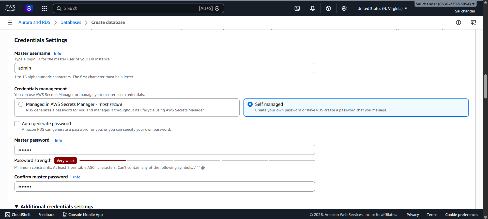
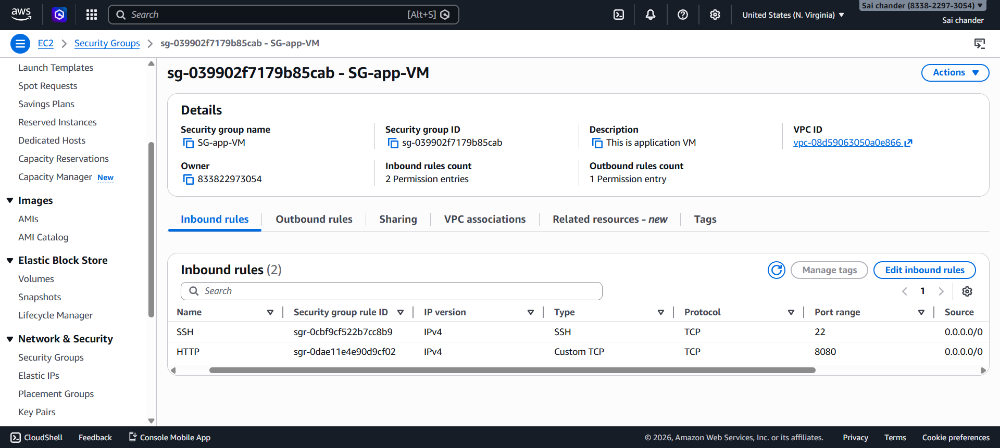

# Deployment of Java Web Application using AWS-RDS (PAAS)

## 1. Objective

To deploy a Java-based web application using:

- Amazon Web Services EC2 (Ubuntu) as Application VM
- Amazon RDS (MySQL) as a managed database (PaaS)

## 2. Architecture Overview

Client Browser → EC2 (Application VM - Ubuntu) → RDS (MySQL Database)

- EC2 hosts the application
- RDS stores the database

## 3. Prerequisites

- AWS Account
- Key Pair (.pem file)
- Basic knowledge of Linux commands
- Internet browser

## 4. RDS Database Setup (PaaS)

### 4.1 Create RDS Instance

Steps:

1. Login to AWS Console
2. Navigate to RDS
3. Click **Create Database**

4. Select:
   - Engine: MySQL
   - Template: Free Tier

   

### 4.2 Configure Database

- Select Engine version: MySQL 8.4.8
- DB Instance Identifier: mydb-instance

- Username: admin
- Password: admin123

- DB Instance configuration

- DB Storage

- VPC and Public Access

### 4.3 Connectivity Settings

- VPC: default VPC
- Public Access: YES

-	Security Group: mysql

-	mysql inbound rules

- Port: 3306
- Security Group: Allow MySQL access

### 4.4 Database Creation

- Create Database
- DB creation success


### 4.5 Get Endpoint

- Copy DB endpoint


## 5. EC2 Application VM Setup (Ubuntu)

### 5.1 Launch EC2 Instance

- VM name: app-vm
- AMI: Ubuntu

- Instance Type: t3.micro
- Key pair: newkey

- Security Group

- Allow ports:
  - 22 (SSH)
  - 8080 (HTTP)

- EC2 instances  


### 5.2 Connect to EC2


## 6. Install Software (Ubuntu)

### 6.1 Install Java and check version


### 6.2 Install Maven and check version


### 6.3 Install Git

```bash
sudo apt install git -y
```

### 6.4 Connect to RDS Database

From App VM (EC2):

```bash
mysql -h <RDS-ENDPOINT> -u admin -p
```

Enter password.

Create table inside MySQL:

```sql
USE jet;

CREATE TABLE USER (
  id int(10) unsigned NOT NULL auto_increment,
  first_name varchar(45) NOT NULL,
  last_name varchar(45) NOT NULL,
  email varchar(45) NOT NULL,
  username varchar(45) NOT NULL,
  password varchar(45) NOT NULL,
  regdate date NOT NULL,
  PRIMARY KEY (id)
);
```
- DESCRIBE USER; 


## 7. Apache Tomcat Setup

### 7.1 Download Tomcat

```bash
cd /opt
sudo wget https://archive.apache.org/dist/tomcat/tomcat-9/v9.0.91/bin/apache-tomcat-9.0.91.tar.gz
```

### 7.2 Extract & Start

```bash
sudo tar -xvzf apache-tomcat-9.0.91.tar.gz
sudo mv apache-tomcat-9.0.91 tomcat9
sudo chmod +x /opt/tomcat9/bin/*.sh
sudo /opt/tomcat9/bin/startup.sh
```

### 7.3 Verify

Open:

```text
http://<App-vm-public-IP>:8080
```

Tomcat should be running.

## 8. Application Deployment

### 8.1 Clone Project

### 8.2 Update Database Connection
Modify DB Connection
Edit:

```bash
vi src/main/webapp/login.jsp
```

Replace:

```text
jdbc:mysql://localhost:3306/jet
```

With:

```text
jdbc:mysql://<RDS-Endpoint>:3306/jet
```

Credentials:

```text
admin / admin123
```

Do the same in:

```bash
vi src/main/webapp/userRegistration.jsp
```


In `pom.xml`, update:

- groupID to `com.mysql`
- artifactID to `mysql-connector-j`
- version to `8.0.33`

### 8.3 Build After Changes

```bash
mvn package
```
Output:


War file created:

Copy WAR file:

```bash
sudo cp target/LoginWebApp.war /opt/tomcat9/webapps/
```

Tomcat auto-deploys it.

Check:

```bash
ls /opt/tomcat9/webapps/
```


-	WAR file inside /opt/tomcat9/webapps/ 

Run application
Open browser

```text
http://<APP-VM-IP>:8080/LoginWebApp/
```
- Application Homepage

- Registration Page 

- Registration Successful 


- Verify in DB 
•	DB table with inserted user

```bash
mysql -h <RDS-ENDPOINT> -u admin -p  
```

- Login success page

