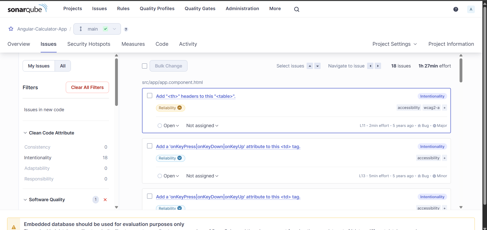

# Task: JavaScript Application Code Analysis using SonarQube

## Objective:

Install and configure SonarQube on a Linux server, connect an Angular Calculator application written in JavaScript, and perform static code analysis using npm-based SonarQube integration.

## Prerequisites

OS - Ubuntu 24.04 LTS / Amazon Linux 2, RAM - Minimum 4 GB (8 GB recommended), Node.js - Version 18 or above, Build tool - npm, Java -		OpenJDK 17, Angular CLI - Latest, SonarQube - 10.x


## Step-1: Setup Application Build Server (Build-VM)
- Launch Ec2 instance on AWS 


- Name instance as Build-VM
- Select ubuntu AMI 


- Select Instance type t3.micro with 2vCPU and 1GB memory, keypair 


-	Security Group rules as SSH port 22 and HTTP port 80 and launch Instance


-	Instance Running 


-	Connected to terminal via SSH client

-	Check if Git is installed, by running command git 


-	If git is not installed, install git

```bash 
sudo apt install git -y
```
-	clone code from GitHub repository
```bash
git clone https://github.com/saichander2311/AngularCalculator.git
```

-	Files in cloned repository AngularCalculator


-	Install Node.js and npm
```bash
sudo apt install nodejs npm -y
```

-	Check node and npm versions
```bash
node -v
npm -v
```

-	Install angular cli
```bash
sudo npm install -g @angular/cli
```

-	Verify Angular CLI
```bash
ng version
```


## Step-2: Setup SonarQube Server (Sonar-VM)
-	Launch Ec2 instance on AWS


-	Name instance as Sonar-VM
-	Select ubuntu AMI 


-	Select Instance type c7i-flex.large with 2vCPU and 4GB memory, keypair 


-	Security Group rules as SSH port 22 and Sonar port 9000 and launch Instance


-	Instance Running 


-	Connected to terminal via SSH client and run updates
-	Install Java 17
```bash
sudo apt install openjdk-17-jdk -y
```

-	Check java version
```bash
java –version
```


-	Download SonarQube
```bash
sudo wget https://binaries.sonarsource.com/Distribution/sonarqube/sonarqube-10.6.0.92116.zip
```

-	Install unzip to unzip the downloaded zip file
```bash
sudo apt install unzip -y
```

-	Unzip downloaded sonarqube zip file
```bash
sudo unzip sonarqube-10.6.0.92116.zip
```


-	Files after unzipping downloaded sonarqube zip file


-	change the ownership of the SonarQube directory so that the ubuntu user and ubuntu group have full access to prevent permission errors.
```bash 
sudo chown -R ubuntu:ubuntu ~/sonarqube-10.6.0.92116
```


-	Start SonarQube and check status
```bash
./sonar.sh start
./sonar.sh status
```

## Step-3: SonarQube on browser
-	SonarQube is running successfully on browser


-	Enter credentials of SonarQube 
-	Default username and password are admin:admin

.png)

-	After log in change password 


-	Dashboard of SonarQube after log in

`Go to Administration -> Security -> Users` 


- In Users dashboard select token to generate token
-	Enter token name, select expiry date and select Generate


-	Copy the Generated token
-	Copy SonarQube IP-address


## Step-4: Configure Angular Project for SonarQube
-	Install SonarQube Scanner Package
-	Inside Angular project:
```bash
npm install sonarqube-scanner --save-dev
```

-	Create sonar-project.properties file inside cloned repository where src/, package.json, angular.json are present and paste this code
```bash
const sonarqubeScanner = require('sonarqube-scanner').default;

sonarqubeScanner(
  {
    serverUrl: 'http://<Sonar-IP>:9000',
    token: 'Sonar-token',
    options: {
      'sonar.projectName': 'Angular-Calculator-App',
      'sonar.projectKey': 'angular-calculator-app',
      'sonar.sources': 'src',
      'sonar.sourceEncoding': 'UTF-8',
    }
  },
  () => process.exit()
);
```


## Step-5: Run Static Code Analysis
-	Execute SonarQube Analysis
```bash 
node sonar-project.properties
```

-	Analysis successful and reports are published


## Step-6: Verify Analysis Results
-	Report is uploaded to SonarQube under projects


-	Open report to check Quality Gate dashboard


-	Quality Gate dashboard


-	Reliability measures how dependable your software is and evaluates whether your code can consistently function without errors, crashes, or unexpected behaviours under stated conditions


-	Issues in details

## Why Static Analysis Security Testing (SAST)
Static Analysis Security Testing (SAST) is used to identify security vulnerabilities, coding issues, and weaknesses in an application's source code before the application is deployed or executed or compiled
## Conclusion
Successfully installed SonarQube, Configured Angular application, Integrated npm-based SonarQube analysis, performed static code analysis and published reports to SonarQube dashboard 
